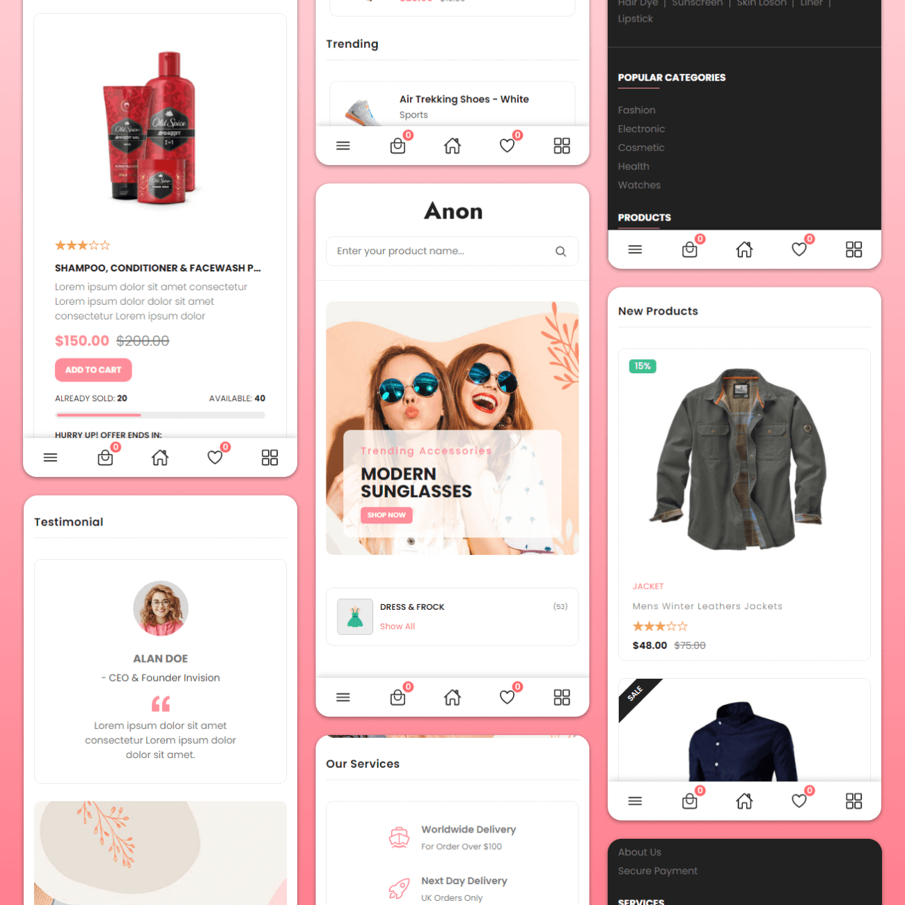

# SaiFashionZone

SaiFashionZone is a fully responsive ecommerce website, maximum compatiblities in all mobile devices, built using HTML, CSS, and JavaScript.The project is a frontend development for the e-commerce website SaiFashionZone, inspired by the Handmade Love by Tanya design. The frontend focuses on creating a visually appealing and user-friendly interface, tailored for selling clothing items like sarees, girls' wear, boys' wear, and ganzy clothes. It ensures seamless integration with the provided backend resources after making necessary adjustments. The completed project has been named handmadelovebytanya-aon-ecommerce-website and is deployed for easy access and review. The design aligns with the assignment requirements and emphasizes intuitive navigation and aesthetics to enhance the user experience.

## Demo

## Prerequisites

Before you begin, ensure you have met the following requirements:

* [Git](https://git-scm.com/downloads "Download Git") must be installed on your operating system.

